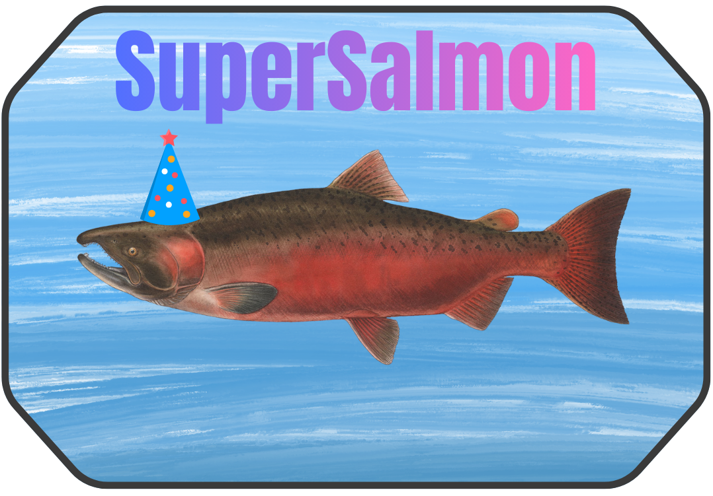
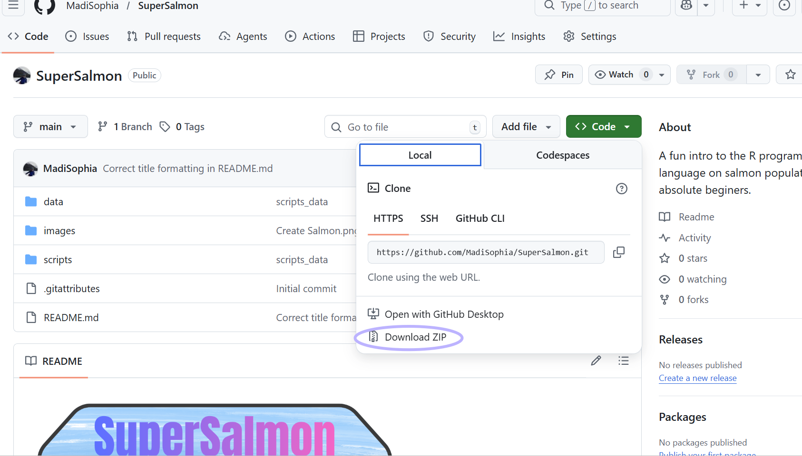

  
</p>


# SuperSalmon: Beginer R tutorial
A fun intro to the R programming language on salmon populations for absolute beginers. We will be analyzing salmon population data from the [Gisasa Weir Dam in Alaska](https://catalog.data.gov/dataset/age-sex-and-length-of-chum-salmon-and-chinook-salmon-sampled-at-the-gisasa-weir-between-19-291e2).
<p align="center">

## Requirements
-Please dowwnload R and Rstudio from the following [link](https://posit.co/download/rstudio-desktop/).


##  1 Cloning repository 
You will first download this repository from Github, this will give you acess to all the data and code on your computer. 
  
</p>

##  2 Composite images
Go to [Script 1](1_FORCE_data_mosaic.py), this will alow you to composite desired images for for selected years,  date windows, bands/indices (EVI, NDVI, and NDMI), and tiles once the paths/paramters are set.

```python
from pathlib import Path

in_root = Path(r"M:\FORCE_Sentinel_2_TSA_2017_2023\level3\tsa\real_values_flagged")
out_root = Path(r"S:\mbrown\Madi_sentinel_2_comp")

years = list(range(2017, 2024))

date_windows = [
    {"name": "aug", "start_mmdd": "08-01", "end_mmdd": "08-31"},
]

output_vars = ["CCI", "NIR", "GRN", "SW1"]

# ----------------------------
# Tile selection find gpkg in repository so you can better identify tile locations
# ----------------------------
# Set to None to process all tiles
# Or provide a list like ["X1234_Y5678", "X2345_Y6789"]
selected_tiles: list[str] | None = None

```
## 3 Extract NFI data
Go to [Script 2](2_NFI_extract.py) and download grid .gpkg from this repository  set set desired paths on local machine for NFI data, desired indices to extract, and  were you want csv containing indices to output (if you have already matched your nfi data to gpkg you can comment this part out)
```python
nfi_path = Path(r"C:\Users\mabrown\Desktop\
