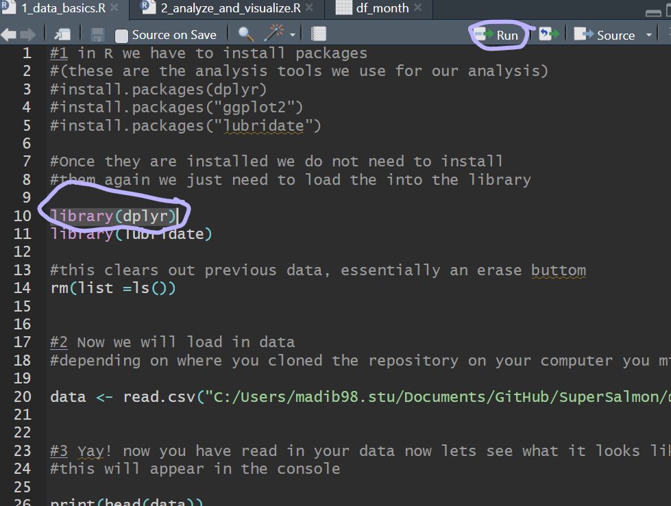
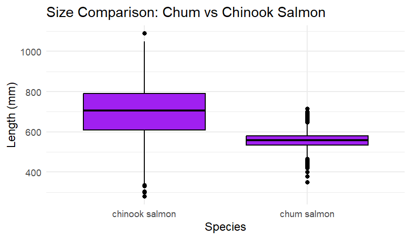
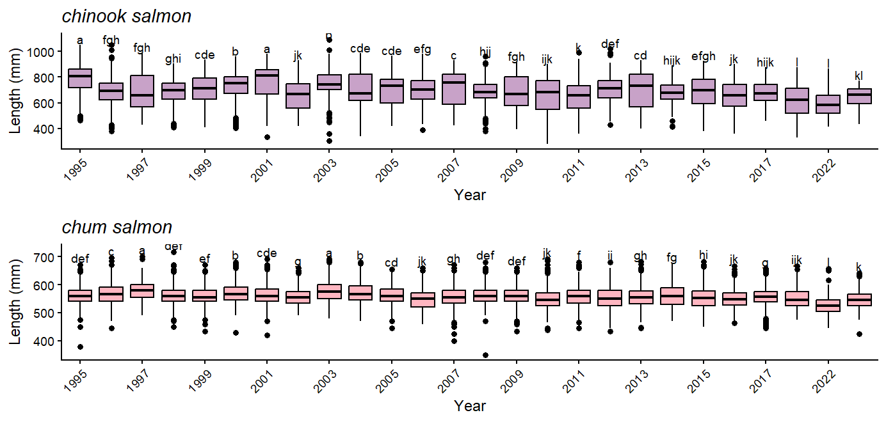

  
</p>


# SuperSalmon: Beginer R tutorial
A fun intro to the R programming language with some  salmon populations data for absolute beginers! We will be analyzing salmon population data from the [Gisasa Weir Dam in Alaska](https://catalog.data.gov/dataset/age-sex-and-length-of-chum-salmon-and-chinook-salmon-sampled-at-the-gisasa-weir-between-19-291e2).
<p align="center">

## Requirements
-Please dowwnload R and Rstudio from the following [link](https://posit.co/download/rstudio-desktop/).


##  1 Downloading repository 
You will first download this repository from Github, this will give you acess to all the data and code on your computer. 
  
</p>

##  2 Download data and installing packages 
One you have the repository downloaded to my computer I will open the first script in Rstudio. We first will need to install the R packages ( these are basically the tools that allow you to do data analysis in R) and set paths to our data essentially telling the program where the data we are trying to analyze is. In this tutorial we will recommending you run scripts line by line for learning ( although in the future you can run the whole thing at once). You do this by highlighting the line with your curser and hit run.   

In script 1 you will first see this section with several "install.package" command. You will need to delete the "#" sign, which allow you to comment out code (i.e., not run it). You only need to install a package onces, after it is in isntalled if you choose to run the script again you can comment it out with a "#" or delete it the "install.package" lines . [Here is more information on R packages](https://r-pkgs.org/)

```R
#1 in R we have to install packages 
#(these are the analysis tools we use for our analysis)
#install.packages(dplyr)
#install.packages("ggplot2")
#install.packages("lubridate")

#Once they are installed we do not need to install 
#them again we just need to load the into the library 

library(dplyr)
library(lubridate)

```
Now that you have loaded your packages you need to tell R were your data is. In script 1 you can see where I originally read the data in. This will be base on where you downloaded it. 
```R
#2 Now we will load in data 
#depending on where you cloned the repository on your computer you might have to adjust this)

data <- read.csv("C:/Users/madib98.stu/Documents/GitHub/SuperSalmon/data/salmon_data.csv")

```

You can find the location of your data by looking in your folder system.
 

 So in this case the lines in script on would be changed to the code below. ( remember when adding file paths the dashes always need to go this way "/"!)
```R
#2 Now we will load in data 
#depending on where you cloned the repository on your computer you might have to adjust this)

data <- read.csv("C:/Users/madib98.stu/Desktop/SuperSalmon-main/data/salmon_data.csv")

```
Yay! now that have you have loaded you data and packages you can run the tutorial line by line to learn some basic data management skills.
## 3 Analyzing data 
Now that you have the basic we will move on to script 2 for some basic data analysis to start answering scientific questions. You will have to install the required packages you did not have previously and set paths to your data like previously. In this tutorial we will attempt to answer 3 scientific questions and visualize them with R [ggplo2](https://ggplot2.tidyverse.org/). Ggplot2 is a very usual R package for creating figures it has many feature and with helpful AI tools like Chatgpt to use as helpers you can make complex figure very quickly. In the previos tutorial we suggest running line by line but please run the ggplot sections of one chunk of code (i.e., highlight the whole code section starting at the plot name. 
```R  
#We are going to try and answer 3 main research questions in this analysis
  
#1- Is there a difference in size between Chum and Chinook salmon?
#2- Is there a difference in salmon numbers over the years?
#3 Is there a statistically significant difference in salmon size over the years?
```
For Q1, we will make box and whisker-plot comparing the sizes of the chum and chinook salmon.
```R  

size_species <- ggplot(data, aes(x = Species, y = Length_mm)) +
  geom_boxplot(fill = "purple", color = "black") +
  labs(title = "Size Comparison: Chum vs Chinook Salmon",
       x = "Species",
       y = "Length (mm)") +
  theme_minimal()

plot(size_species)
```
Our output should look like this.
 

For Q2, we summarize the salmon counts by year and make a bar chart so they can be compared.
```R  
# Make sure Date is Date format
data$Date <- as.Date(data$Date)

# Extract year
data <- data %>%
  mutate(Year = year(Date))

# Count fish per year per species
df_year <- data %>%
  group_by(Year, Species) %>%
  summarize(n = n(), .groups = "drop")


#Now we plot out salmon per year 
salmon_year <-ggplot(df_year, aes(x = factor(Year), y = n, fill = Species)) +
  geom_col(position = "dodge", color = "white", linewidth = 0.4) +  # white outlines
  
  # Show every other year label
  scale_x_discrete(breaks = function(x) x[seq(1, length(x), by = 2)]) +
  
  # Lilac & pink colors
  scale_fill_manual(values = c("chinook salmon" = "#C8A2C8",
                               "chum salmon"    = "#FFB6C1")) +
  
  # White background theme
  theme_classic() +
  
  labs(title = "Annual Salmon Counts by Species",
       x = "Year",
       y = "fish count")


plot(salmon_year)
```
Our output should look like this.
 


Last, for Q3 we want to see if there is a statically significant differences between size by year. We create a box and whisker plot and use [kruskall-wallis Dunn's test](https://en.wikipedia.org/wiki/Kruskal%E2%80%93Wallis_test) with a 95% confidence interval to se if there is a signifance difference in fish size by year. The letters on top of each box and whisker plot represent the groups the values are statistically different or not from (e.g., if 1990 was a and 2000 was a these groups would not be statically significantly differen from eachother. 
```R  
# PREPARE DATA
data$Date <- as.Date(data$Date)
data <- data %>% mutate(
  Year = factor(year(Date)),
  Species = factor(Species)
)

# COLOR PALETTE
species_colors <- c("chinook salmon" = "#C8A2C8",
                    "chum salmon"    = "#FFB6C1")

# FUNCTION TO CALCULATE CLD LETTERS
get_cld <- function(df){
  kw <- kruskal.test(Length_mm ~ Year, data = df)
  if(kw$p.value < 0.05){
    dunn <- agricolae::kruskal(df$Length_mm, df$Year, group = TRUE)
    cld <- dunn$groups
    cld$Year <- rownames(cld)
    return(cld[, c("Year", "groups")])
  } else {
    years <- levels(df$Year)
    return(data.frame(Year = years, groups = "a"))
  }
}

# CREATE PLOTS FOR EACH SPECIES
p_list <- list()

for(sp in levels(data$Species)){
  
  sp_data <- data %>% filter(Species == sp)
  
  # Get CLD letters
  cld_df <- get_cld(sp_data)
  
  # Compute y-position for letters (just above max)
  medians <- sp_data %>% group_by(Year) %>% summarize(y = max(Length_mm, na.rm = TRUE) + 5)
  cld_df <- dplyr::left_join(cld_df, medians, by = "Year")
  
  # Create boxplot
  # Create boxplot with adjusted letters
  p <- ggplot(sp_data, aes(x = Year, y = Length_mm, fill = Species)) +
    geom_boxplot(color = "black") +
    scale_fill_manual(values = species_colors) +
    geom_text(data = cld_df, 
              aes(x = Year, y = y + 5, label = groups),  # raise letters higher
              vjust = 0, 
              size = 3,                                # smaller text
              inherit.aes = FALSE) +
    theme_classic() +
    labs(title = sp,
         x = "Year",
         y = "Length (mm)") +
    theme(
      legend.position = "none",
      plot.title = element_text(face = "italic"),
      axis.text.x = element_text(angle = 45, hjust = 1)
    ) +
    # Label every other year
    scale_x_discrete(breaks = levels(sp_data$Year)[seq(1, length(levels(sp_data$Year)), by = 2)])
  
  p_list[[sp]] <- p
}

# COMBINE WITH COWPLOT
combined_plot <- cowplot::plot_grid(plotlist = p_list, ncol = 1, align = "v")
plot(combined_plot)
```
Our output should look like this.
 
 

## 4 Try on your own  
Nice work:) Now that you have run through this tutorial, I would encourage you to come up with one of your own research questions you would like to understand of the data and trying using your own skills to answer it. Try creating a blank script deciding your needed package, reading in your data, and creating one visualization to answer your questions.
